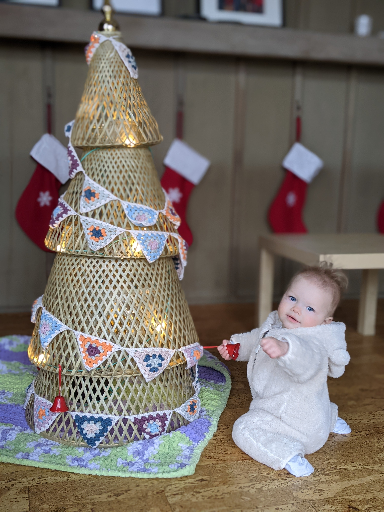
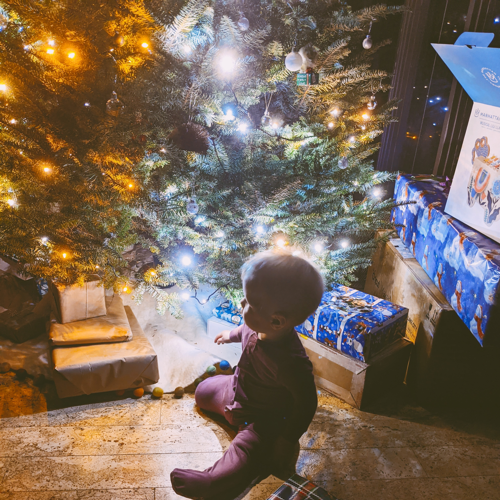

Some tips that have worked for us:

1. Put bells on the bottom of your tree so you'll know if baby starts to mess with it.

2. Get baby her own tree.

I ordered this bamboo tree from Ikea. I used solar camping lights to decorate it, which need to be plugged in, and I threaded them in the inside, not the outside. Then I wrapped it in baby safe bunting.

3. Obvious, but don't hang ornaments within their reach on your tree.

4. A moat of presents around the bottom prevents them from pulling down the branches.

Happy holidays!
